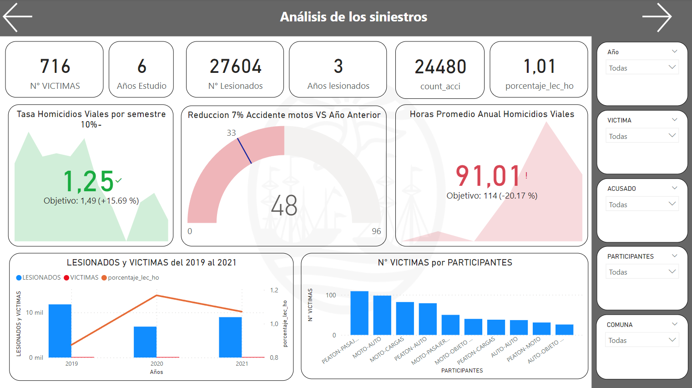
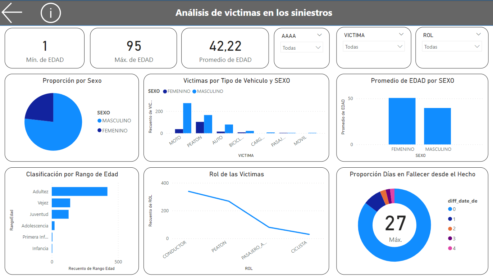
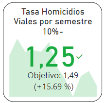
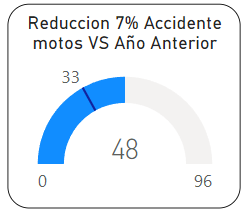
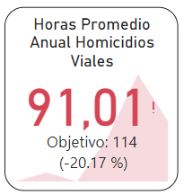

<h1 align='center'>
 <b>PROYECTO INDIVIDUAL Nº2</b>
</h1>
 
# <h1 align="center">**`Siniestros viales`**</h1>

<h1 align='center'>
 <b>William Castro Rojas</b>
</h1>

<h1 align='center'>
 <b>***Data Analyst***.</b>
</h1>

## **`Tabla de Contenidos`**

- [Introducción](#introducción)
- [Contexto](#Contexto)
- [Desarrollo](#desarrollo)
    - [ETL - EDA](#ETL-EDA)
- [Conclusión](#Conclusión)
- [Fuente_de_datos](#Fuente de datos)
- [Contacto](#contacto)

- ## **`Links`**
    - [Carpeta con los dataset](./datasets/)
    - [Proceso de ETL](./EDA/)
    - [Proceso de EDA](./ETL/)

# **Introducción-**

El Observatorio de Movilidad y Seguridad Vial (OMSV), centro de estudios que se encuentra bajo la órbita de la Secretaría de Transporte del Gobierno de la Ciudad Autónoma de Buenos Aires, nos ha encomendado la tarea de realizar un proyecto de análisis de datos. El objetivo de este proyecto es generar información que permita a las autoridades locales tomar medidas efectivas para reducir la cantidad de víctimas fatales en los siniestros viales.

Para llevar a cabo este análisis, contamos con un dataset que proporciona información detallada sobre los homicidios en siniestros viales ocurridos en la Ciudad de Buenos Aires durante el período comprendido entre 2016 y 2021. Este dataset nos brinda una visión amplia de los accidentes de tránsito en la ciudad, incluyendo datos sobre el número y tipo de víctimas, características de los siniestros, y otros factores relevantes.

A través de este informe, nos proponemos analizar en profundidad los patrones y tendencias observados en estos incidentes, con el fin de identificar áreas de mejora y oportunidades para implementar medidas preventivas. Nuestro objetivo final es contribuir a la creación de políticas y acciones que promuevan la seguridad vial y reduzcan la incidencia de accidentes en la Ciudad de Buenos Aires.

# **Contexto**

En Argentina, cada año mueren cerca de 4.000 personas en siniestros viales. Aunque muchas jurisdicciones han logrado disminuir la cantidad de accidentes de tránsito, esta sigue siendo la principal causa de muertes violentas en el país.
Los informes del Sistema Nacional de Información Criminal (SNIC), del Ministerio de Seguridad de la Nación, revelan que entre 2018 y 2022 se registraron 19.630 muertes en siniestros viales en todo el país. Estas cifras equivalen a 11 personas por día que resultaron víctimas fatales por accidentes de tránsito.

Solo en 2022, se contabilizaron 3.828 muertes fatales en este tipo de hechos. Los expertos en la materia indican que en Argentina es dos o tres veces más alta la probabilidad de que una persona muera en un siniestro vial que en un hecho de inseguridad delictiva.

# **Desarrollo**

`Dashboard`

  
  

Se construyeron dos paneles de control interactivos en la herramienta Power BI. El primero se centra en los siniestros viales y permite visualizar KPIs, el número de víctimas, vehículos acusados y víctimas, así como la ubicación geográfica de los accidentes coloreada por comuna. También muestra las víctimas por año, día de la semana y hora del día, con filtros adicionales por año, tipo de víctima, acusado y comuna.

El segundo panel de control permite una visualización más detallada de la caracterización de las víctimas, incluyendo la edad media, género, rango de edades, roles y días transcurridos desde el accidente hasta el fallecimiento de las víctimas. Este panel también cuenta con filtros por año, tipo de víctima y rol.

`Análisis` :warning:
Se detectaron varios indicadores de riesgo. Los días de fin de semana, especialmente en las horas de la madrugada, presentan promedios más altos de siniestros viales. En la mayoría de los casos, las víctimas son motociclistas. Además, el promedio de muertes por hora muestra que las 4 de la mañana tienen el promedio más alto, lo que señala un momento crítico en términos de accidentes viales.

`KPIs`

- *Reducir en un 10% la tasa de homicidios en siniestros viales de los últimos seis meses, en CABA, en comparación con la tasa de homicidios en siniestros viales del semestre anterior*.
  
  

  la tasa de homicidios en siniestros viales es el número de víctimas fatales en accidentes de tránsito por cada 100,000 habitantes en un área geográfica durante un período de tiempo específico. 
  
- *Reducir en un 7% la cantidad de accidentes mortales de motociclistas en el último año, en CABA, respecto al año anterior*.
  
    

  Se definimos a la cantidad de accidentes mortales de motociclistas en siniestros viales como el número absoluto de accidentes fatales en los que estuvieron involucradas víctimas que viajaban en moto en un determinado periodo temporal.

- *Matener las horas promedio en que hay un siniestro por encima de 114 horas*

  

  Se define con las horas medias entre siniestris en un tiempo determinado en este caso es por año

## ETL - EDA

`ETL`

Se realizaron las siguientes etapas en el proceso de Extracción, Transformación y Carga (ETL):

- Extracción: Los archivos con extensión .xlsx fueron cargados utilizando Visual Studio Code con Python. Se emplearon las librerías Pandas, NumPy y re para el tratamiento de datos.

- Transformación: Se visualizó la información y se identificaron filas con valores 'SD', que indican datos faltantes. Dado que su proporción en comparación con los datos válidos era mínima, se utilizó la media y la moda como métodos estadísticos para imputar los datos faltantes en cada caso. Se verificaron duplicados, se formatearon las columnas y se aseguró que no hubiera datos nulos ni con la palabra 'SD'. Durante este proceso, se eliminó una fila que contenía solo tres datos, ya que no se consideró relevante y su eliminación no afectaba significativamente el análisis.

- Carga: Finalmente, los datos procesados se exportaron a un archivo CSV.

Este proceso garantizó la integridad y consistencia de los datos, así como su preparación para su posterior análisis.

`EDA`

Para el análisis exploratorio de datos (EDA), se utilizaron los conjuntos de datos procesados y limpios obtenidos del proceso ETL. Se inició verificando la composición de las columnas mediante un método .describe(include='all'). Se identificaron los valores más frecuentes (top) tanto para víctimas como para acusados, los cuales fueron estudiados en detalle posteriormente.

Se procedió a analizar la presencia de posibles valores atípicos (outliers) en las columnas de longitud y latitud para verificar la correcta referencia geográfica, considerando que los datos se limitan a una única ciudad. Se esperaba que estos datos geográficos estuvieran cercanos entre sí.

También se examinó la columna N_VICTIMAS en busca de posibles valores atípicos, encontrando uno con 3 víctimas. Este caso se investigó con mayor detalle y se descubrió que correspondía a un accidente ocurrido a las 5 de la mañana, donde un automóvil impactó contra un objeto fijo.

Se procedió entonces a analizar si existía alguna relación entre los días de la semana, la hora del día y el número de víctimas. Se identificó inicialmente un leve aumento los fines de semana, especialmente los viernes. Se verificaron estas tendencias para los días viernes, sábado y domingo en relación con las horas de los accidentes, encontrando que el pico más alto se presentaba los domingos entre las 5 y las 7 de la mañana.

Además, se realizó un análisis más detallado por tipo de víctima y acusado. Se identificó que los acusados en esos días y horas eran principalmente automóviles y objetos fijos, mientras que las víctimas en su mayoría eran motociclistas y peatones. Estos hallazgos proporcionan una visión detallada de la dinámica de los accidentes viales en los días y horarios específicos mencionados.

# **Conclusión**

Después de realizar el análisis de datos y crear los dashboards, se puede concluir lo siguiente:

Al revisar la gráfica de accidentes por año, se observa que el año 2020 tuvo la menor cantidad de accidentes. Esto podría asociarse con la época de la pandemia, cuando las aglomeraciones no estaban permitidas. Por lo tanto, se podría inferir que las reuniones nocturnas y sus actividades asociadas, como el consumo de alcohol y la falta de descanso, podrían ser factores que contribuyeron a un aumento en la tasa de homicidios viales en 2021 y años anteriores, excluyendo el 2020.

Este análisis se respalda con los promedios más altos de accidentes en días específicos, siendo los domingos el día con el promedio más alto. Además, el hecho de que los objetos fijos sean el segundo tipo de acusado en estos días y horarios sugiere la posibilidad de microsueños o falta de conciencia por parte de los conductores.

Es importante tener en cuenta que estas conclusiones se basan en supuestos y que cualquier recomendación para abordar esta problemática debería ser respaldada por un análisis más detallado y específico de cada situación.

Es importante destacar que este trabajo tiene fines educativos y busca demostrar las capacidades de análisis de datos del creador del contenido para el bootcamp de Henry.

- [Buenos Aires Data](https://data.buenosaires.gob.ar/dataset/victimas-siniestros-viales): deberán utilizar el dataset denominado `Homicidios`

## Contacto

  
  

