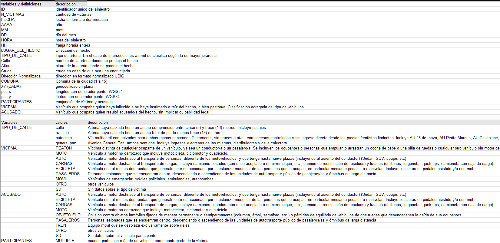
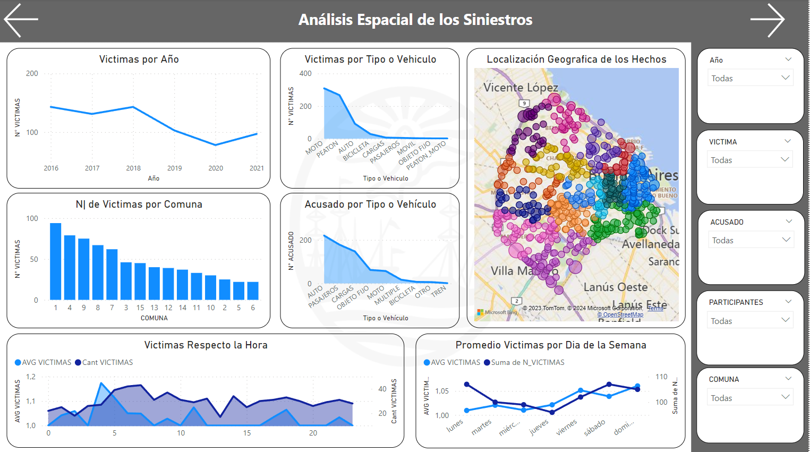

<h1 align='center'>
 <b>PROYECTO INDIVIDUAL Nº2</b>
</h1>
 
# <h1 align="center">**`Siniestros viales`**</h1>

<h1 align='center'>
 <b>William Castro Rojas</b>
</h1>

<h1 align='center'>
 <b>***Data Analyst***.</b>
</h1>

## **`Tabla de Contenidos`**
  
  - [Introducción](#introducción)
  - [Contexto](#Contexto)
  - [Diccionario](#Diccionario)
  - [Desarrollo](#desarrollo)
  - [ETL-EDA](#ETL-EDA)
  - [Conclusión](#Conclusión)
  - [Contacto](#contacto)
  
  - **Links**
    - [Carpeta con los dataset](./Datasets/)
    - [Proceso de ETL](./ETL/)
    - [Proceso de EDA](./EDA/)

  
<h2>Introducción</h2>

El Observatorio de Movilidad y Seguridad Vial (OMSV), centro de estudios que se encuentra bajo la órbita de la Secretaría de Transporte del Gobierno de la Ciudad Autónoma de Buenos Aires, nos ha encomendado la tarea de realizar un proyecto de análisis de datos. El objetivo de este proyecto es generar información que permita a las autoridades locales tomar medidas efectivas para reducir la cantidad de víctimas fatales en los siniestros viales.

Para llevar a cabo este análisis, contamos con un dataset que proporciona información detallada sobre los homicidios en siniestros viales ocurridos en la Ciudad de Buenos Aires durante el período comprendido entre 2016 y 2021. Este dataset nos brinda una visión amplia de los accidentes de tránsito en la ciudad, incluyendo datos sobre el número y tipo de víctimas, características de los siniestros, y otros factores relevantes.

A través de este informe, nos proponemos analizar en profundidad los patrones y tendencias observados en estos incidentes, con el fin de identificar áreas de mejora y oportunidades para implementar medidas preventivas. Nuestro objetivo final es contribuir a la creación de políticas y acciones que promuevan la seguridad vial y reduzcan la incidencia de accidentes en la Ciudad de Buenos Aires.

  
<h2>Contexto</h2>

En Argentina, cada año mueren cerca de 4.000 personas en siniestros viales. Aunque muchas jurisdicciones han logrado disminuir la cantidad de accidentes de tránsito, esta sigue siendo la principal causa de muertes violentas en el país.
Los informes del Sistema Nacional de Información Criminal (SNIC), del Ministerio de Seguridad de la Nación, revelan que entre 2018 y 2022 se registraron 19.630 muertes en siniestros viales en todo el país. Estas cifras equivalen a 11 personas por día que resultaron víctimas fatales por accidentes de tránsito.

Solo en 2022, se contabilizaron 3.828 muertes fatales en este tipo de hechos. Los expertos en la materia indican que en Argentina es dos o tres veces más alta la probabilidad de que una persona muera en un siniestro vial que en un hecho de inseguridad delictiva.

# **Diccionario**

  
<h2>Desarrollo</h2>

`Dashboard`

  
  
  

Se desarrollaron tres paneles de control interactivos utilizando Power BI. Se utilizaron tres tablas, dos importadas desde archivos CSV y una desde una base de datos MySQL.

El primer panel se enfoca en los siniestros viales y proporciona un contexto general de los accidentes en la Ciudad Autónoma de Buenos Aires (CABA). En este panel, se pueden visualizar el número de víctimas en los siniestros, comparándolo con la cantidad de accidentes y lesionados en la ciudad. Además, se presentan los indicadores clave de rendimiento (KPI) con sus respectivos objetivos y cumplimientos, así como también se incluye una comparación de los últimos tres años en cuanto a la cantidad de lesionados y víctimas fatales. Este panel es interactivo y cuenta con filtros y herramientas para ampliar la información de las gráficas.

El segundo panel muestra los aspectos espaciales de los siniestros viales. Permite visualizar la cantidad de víctimas por año, trimestre y mes, así como también las víctimas y acusados según el tipo de vehículo involucrado. Incluye un mapa que muestra las ubicaciones geográficas (latitud y longitud) de los accidentes, coloreadas según una columna que representa el número de víctimas. También presenta información sobre las horas con el promedio y la cantidad de víctimas de acuerdo con la hora del día y el día de la semana. Este panel también es interactivo y ofrece filtros y herramientas para explorar los datos en detalle.

El tercer panel se centra en la información demográfica de las víctimas. Ofrece detalles como la edad promedio de las víctimas, el género de las mismas, la relación entre el género y el tipo de vehículo involucrado en el accidente, los días transcurridos desde el accidente hasta el fallecimiento de las víctimas, y el rango de edad de las mismas.

`Análisis` 
Se detectaron varios indicadores de riesgo. Los días de fin de semana, especialmente en las horas de la madrugada, presentan promedios más altos de siniestros viales. En la mayoría de los casos, las víctimas son motociclistas. Además, el promedio de muertes por hora muestra que las 4 de la mañana tienen el promedio más alto, lo que señala un momento crítico en términos de accidentes viales.

`KPIs`

- *Reducir en un 10% la tasa de homicidios en siniestros viales de los últimos seis meses, en CABA, en comparación con la tasa de homicidios en siniestros viales del semestre anterior*.
  
  

  la tasa de homicidios en siniestros viales es el número de víctimas fatales en accidentes de tránsito por cada 100,000 habitantes en un área geográfica durante un período de tiempo específico. 
  
- *Reducir en un 7% la cantidad de accidentes mortales de motociclistas en el último año, en CABA, respecto al año anterior*.
  
    

  Se definimos a la cantidad de accidentes mortales de motociclistas en siniestros viales como el número absoluto de accidentes fatales en los que estuvieron involucradas víctimas que viajaban en moto en un determinado periodo temporal.

- *Matener las horas promedio en que hay un siniestro por encima de 114 horas*

  

  Se define con las horas medias entre siniestris en un tiempo determinado en este caso es por año

  
<h2>ETL-EDA</h2>

[**ETL**](/ETL/)

Se realizaron las siguientes etapas en el proceso de Extracción, Transformación y Carga (ETL):

- Extracción: Los archivos con extensión .xlsx fueron cargados utilizando Visual Studio Code con Python. Se emplearon las librerías Pandas, NumPy y re para el tratamiento de datos.

- Transformación: Se visualizó la información y se identificaron filas con valores 'SD', que indican datos faltantes. Dado que su proporción en comparación con los datos válidos era mínima, se utilizó la media y la moda como métodos estadísticos para imputar los datos faltantes en cada caso. Se verificaron duplicados, se formatearon las columnas y se aseguró que no hubiera datos nulos ni con la palabra 'SD'. Durante este proceso, se eliminó una fila que contenía solo tres datos, ya que no se consideró relevante y su eliminación no afectaba significativamente el análisis.

- Carga: Finalmente, los datos procesados se exportaron a un archivo CSV.

Este proceso garantizó la integridad y consistencia de los datos, así como su preparación para su posterior análisis.

[**EDA**](/EDA/) 

Para el análisis exploratorio de datos (EDA), se utilizaron los conjuntos de datos procesados y limpios obtenidos del proceso ETL. Se inició verificando la composición de las columnas mediante un método .describe(include='all'). Se identificaron los valores más frecuentes (top) tanto para víctimas como para acusados, los cuales fueron estudiados en detalle posteriormente.

Se procedió a analizar la presencia de posibles valores atípicos (outliers) en las columnas de longitud y latitud para verificar la correcta referencia geográfica, considerando que los datos se limitan a una única ciudad. Se esperaba que estos datos geográficos estuvieran cercanos entre sí.

También se examinó la columna N_VICTIMAS en busca de posibles valores atípicos, encontrando uno con 3 víctimas. Este caso se investigó con mayor detalle y se descubrió que correspondía a un accidente ocurrido a las 5 de la mañana, donde un automóvil impactó contra un objeto fijo.

Se procedió entonces a analizar si existía alguna relación entre los días de la semana, la hora del día y el número de víctimas. Se identificó inicialmente un leve aumento los fines de semana, especialmente los viernes. Se verificaron estas tendencias para los días viernes, sábado y domingo en relación con las horas de los accidentes, encontrando que el pico más alto se presentaba los domingos entre las 5 y las 7 de la mañana.

Además, se realizó un análisis más detallado por tipo de víctima y acusado. Se identificó que los acusados en esos días y horas eran principalmente automóviles y objetos fijos, mientras que las víctimas en su mayoría eran motociclistas y peatones. Estos hallazgos proporcionan una visión detallada de la dinámica de los accidentes viales en los días y horarios específicos mencionados.

# **Conclusión**

Después de analizar los datos y crear los dashboards, se puede concluir lo siguiente:

La gráfica de accidentes por año muestra que en 2020 se registró la menor cantidad de accidentes. Esto podría estar relacionado con las restricciones de la pandemia, que limitaron las aglomeraciones. Se podría inferir que las reuniones nocturnas, el consumo de alcohol y la falta de descanso contribuyeron al aumento de la tasa de homicidios viales en 2021 y años anteriores, excluyendo 2020.

Estos hallazgos se respaldan con los promedios más altos de accidentes en días específicos, siendo los domingos el día con el promedio más alto. Además, el hecho de que los objetos fijos sean el segundo tipo de acusado en estos días y horarios sugiere la posibilidad de microsueños o falta de conciencia por parte de los conductores.

Se recomienda tomar medidas que concienticen a los conductores sobre la importancia de no conducir bajo los efectos del alcohol, la peligrosidad de los microsueños y la importancia de mantenerse alerta al volante. También se sugiere verificar la visibilidad de las señales de tránsito durante la noche y reforzar los controles durante los días y horas identificados con mayor número de casos para asi cumplir con los objetivos.

Es fundamental tener en cuenta que estas conclusiones se basan en un análisis general y que cualquier recomendación específica debe respaldarse con un análisis más detallado de cada situación.

Finalmente, es importante destacar que este trabajo tiene fines educativos y busca demostrar las habilidades de análisis de datos del autor para el bootcamp de Henry.

- [Buenos Aires Data](https://data.buenosaires.gob.ar/dataset/victimas-siniestros-viales): Dataset utilizado `Homicidios`

## Contacto

  
  

